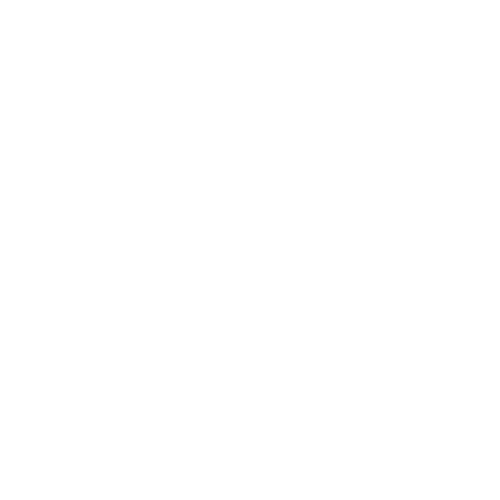

<div align="center">
	
  
# Kobis Travels & Tours Ltd Website
**Personalized Support for Your Academic, Travel & Visa Goals**
</div>

## 1. Overview
Static, mobile‑first marketing site for Kobis Travels & Tours Ltd. Focused on clarity, trust and conversion (consultation booking & inquiries). Built with plain HTML, modern CSS and lightweight JavaScript—no framework required for hosting.

## 2. Core Proposition
Mentorship + structured guidance for students, professionals and travelers: academic pathways, visa preparation, financial documentation, travel logistics.

## 3. Key Site Features
- Hero section with clear value statement and dual CTAs.
- Sticky, responsive navigation (Home / About / Services / Contact) + accessible skip link.
- Services grid (7 core service offerings).
- Partners section (initial: CIMT College, Canada).
- Contact panel with phone, email & social links plus inquiry form (client‑side placeholder submission logic).
- Floating WhatsApp chat button for immediate outreach.
- Scroll reveal animations & smooth in‑page navigation.
- SEO meta tags, Open Graph, Twitter Card, JSON‑LD Organization schema.
- Fully local image asset handling via `images/` directory.

## 4. Services List
1. One‑on‑One Mentorship  
2. Individual Counselling  
3. Cost Evaluation  
4. Study Pathway Advice  
5. Visit Visa Pathway Advice  
6. Flight & Ticket Assistance  
7. Proof of Funds Guidance

## 5. Consultation Fee
N10,000 per hour (not displayed as a standalone section; referenced in form hint and can be reinstated easily—see commented note in code if needed).

## 6. Partners
- CIMT College, Canada (logo displayed in Partners section).

## 7. Tech Stack
Pure static assets:
- HTML5 (`index.html`)
- Modern CSS (`styles.css`) with custom properties, responsive grid & utility classes
- Vanilla JS (`script.js`) for navigation, reveal animations & smooth scroll
- Feather Icons (inline via CDN)

No build step required; optional tooling (Vite or other) can be added later if you introduce modular JS or componentization.

## 8. Project Structure
```
index.html
styles.css
script.js
images/
	logo.png
	cimt-college-logo.png
	hero.jpg
	about.jpg
	social-share.jpg
	favicon.png
	apple-touch-icon.png
site.webmanifest
robots.txt
sitemap.xml
```
(Add optional `logo-dark.png`, WebP variants: `hero.webp`, `about.webp`).

## 9. Image & Asset Guidelines
Place all brand & content imagery in `images/` only. Recommended optimizations:
- Use WebP for large photographic assets (keep a JPEG fallback).
- Aim: hero < 250 KB desktop / < 120 KB mobile; about image < 140 KB.
- Use tools: Squoosh, TinyPNG, ImageOptim.
- Provide a 1200×630 `social-share.jpg` for OG/Twitter previews.

Example responsive pattern:
```html
<picture>
	<source srcset="images/hero.webp" type="image/webp" />
	
</picture>
```

## 10. Customization
| Area | How to Change |
|------|---------------|
| Services | Edit cards inside `#services` in `index.html` |
| Partner logos | Duplicate `.partner` block in Partners section |
| Colors | Adjust CSS custom properties in `:root` within `styles.css` |
| Consultation fee text | Update form hint or reintroduce highlight section |
| WhatsApp number | Modify `window.KOBIS_CONFIG.whatsapp` in `<head>` or edit direct link |
| Hero background | Replace `images/hero.jpg` (and add `hero.webp`) |
| Logo | Replace `images/logo.png` (keep dimensions balanced) |
| Social meta | Update domain + image URLs in `<head>` meta tags |

## 11. Deployment
Any static hosting works: Netlify, Vercel, GitHub Pages, Cloudflare Pages, S3 + CloudFront.

Minimum steps (example Netlify):
1. Drag project folder into Netlify dashboard OR connect repository.
2. Build command: (none) — Publish directory: root.

Vercel: import project → Framework preset: “Other” → No build command.

GitHub Pages: place files at repo root and enable Pages (main branch / root).

## 12. SEO Checklist
- Replace `https://your-domain.example/` with real production domain in: canonical link, OG tags, JSON‑LD, sitemap, robots.
- Supply a valid `social-share.jpg`.
- Add alt text for all added partner logos or decorative images.
- Keep `<title>` under ~60 chars; meta description under ~160.

## 13. Performance & Accessibility
- Preload critical logo (`<link rel="preload" as="image" href="images/logo.png">`).
- Consider `loading="lazy"` on non-hero images (already applied).
- Ensure color contrast when modifying palette (WCAG AA baseline).
- Lighthouse target: Performance > 90, Accessibility > 95 with optimized images & proper alt text.

## 14. Future Enhancements (Optional)
- Backend / form handling service (Formspree, EmailJS, serverless function).
- Analytics (Plausible / Google Analytics v4).
- Multi-language support.
- FAQ & Testimonials sections.
- Dark-mode toggle (color tokens already structured to extend).

## 15. Maintenance Tasks
- Audit links quarterly (social platforms & partner URLs).
- Refresh OG image annually or when branding changes.
- Re‑optimize images after major visual updates.

## 16. License / Usage
All content, brand assets and compiled site © 2025 Kobis Travels & Tours Ltd. All rights reserved. Do not reuse branding or proprietary copy without written permission.

## 17. Contact
**Phone:** +234 814 357 4770  
**Email:** kobistravelsandtours@gmail.com  
**Facebook / Instagram / TikTok:** @kobistravelsandtours  
**WhatsApp:** +234 814 357 4770

"Your Journey Starts Here."

---
For structural or technical adjustments submit changes via pull request or update files directly (static stack). If you need a React or CMS version later, the current semantic markup converts cleanly.
